  

  

  
  
  

  

---

## 👨‍💻 About Me

I'm an **Information Technology Engineering student at NBN Sinhgad School of Engineering, Pune**, passionate about building scalable, responsive, and production-oriented applications.

My experience spans **cross-platform mobile development, full-stack development, backend integrations, real-time systems, Firebase, AI-powered applications, automation, and software testing**.

- 🎓 B.E. in Information Technology — SPPU
- 📱 Experienced in **Flutter & Dart** cross-platform development
- 🌐 Building applications with **React.js, JavaScript, Node.js & REST APIs**
- 🏗️ Interested in **Clean Architecture, Feature-First Architecture & scalable application design**
- 🔥 Experienced with the **Firebase ecosystem and real-time application features**
- 🤖 Building AI-powered applications using **Google Gemini**
- 🔌 Experience with **Socket.IO, third-party APIs, payments, notifications & cloud services**
- 🧪 Background in **software testing, API testing and quality assurance**

---

  

---

# 💼 Experience

### 🏥 Full Stack Development Intern — Vedika Health Private Limited

**Feb 2026 – Aug 2026 · Pune, Maharashtra**

- Developed and maintained cross-platform healthcare applications using **Flutter, Dart, React.js and JavaScript**
- Implemented **Clean Architecture, Feature-First Architecture, BLoC/Cubit and Redux**
- Integrated **Firebase Authentication, Firestore, Cloud Storage, FCM, Crashlytics and Performance Monitoring**
- Developed real-time healthcare features including **ambulance booking and tracking, chat and video consultation**
- Worked with **GPS/location services, Google Maps, Socket.IO and REST APIs**
- Integrated **Razorpay payments**
- Contributed to deployment using **Git, GitHub, Firebase Hosting, Netlify and Shorebird**

---

### 📱 Mobile Application Development Intern — Incubators Systems Pvt. Ltd.

**Nov 2025 – Feb 2026 · Pune, Maharashtra**

- Developed high-performance cross-platform mobile applications using **Flutter and Dart**
- Designed and implemented responsive UI/UX using **Figma**
- Translated wireframes and design prototypes into reusable Flutter components
- Integrated **Firebase Authentication, Firestore and Cloud Storage**
- Implemented **SQLite-based local data persistence** for offline functionality
- Collaborated in an Agile development environment using **Git, GitHub and GitLab**

---

### 🧪 QA Tools & Test Development Intern — The Subscription

**May 2025 – Aug 2025 · Pune, Maharashtra**

- Developed and executed manual and automated test cases
- Performed **functional, regression, integration and API testing**
- Created test scenarios, test cases and test documentation
- Identified, documented and tracked software defects
- Collaborated with developers to reproduce issues and verify fixes

---

  

# 🚀 Featured Projects

## 🧠 SkillsIgnite — AI-Powered E-Learning Platform

A cross-platform e-learning platform designed around students, recruiters and administrators.

### ✨ Highlights

- 👨‍🎓 Student, Company/Recruiter and Admin roles
- 🔐 Role-based authentication and access control
- 🤖 AI-powered lecture summarization using **Google Gemini**
- 💡 AI-powered doubt solving
- 📚 Personalized study planning
- 🎯 Course recommendations
- 🎥 Video lessons and learning reels
- 📝 Digital note-taking
- 📈 Learning progress tracking
- 🔥 Streaks and badges
- 📥 Downloadable study materials
- 💼 Recruiter job postings and student discovery
- 🏆 Hackathon management
- 👥 Team registration and submission tracking
- 📄 PDF processing
- 🎙️ Speech-to-Text
- 🔊 Text-to-Speech
- 💻 In-app code execution

**Tech:** Flutter · Dart · Firebase · SQLite · Riverpod · Provider · Google Gemini

---

## 👟 E-Commerce Footwear Platform

A responsive Flutter-based e-commerce application featuring a dynamic product catalog and shopping experience.

### ✨ Highlights

- 🛍️ Dynamic product catalog
- 🛒 Shopping cart functionality
- 🔄 Global state management using Provider
- 📱 Responsive mobile interface
- 🖥️ Desktop-adaptive interface
- 📐 Adaptive layouts using LayoutBuilder and GridView
- ⚡ Synchronized application state across screens

**Tech:** Flutter · Dart · Provider · Responsive UI

---

# 🛠️ Technologies & Tools

## 💻 Programming Languages

  <a href="https://python.org">
     
    <b>Python</b>
  </a>
  &nbsp;&nbsp;&nbsp;&nbsp;&nbsp;&nbsp;
  <a href="https://dart.dev">
     
    <b>Dart</b>
  </a>
  &nbsp;&nbsp;&nbsp;&nbsp;&nbsp;&nbsp;
  <a href="https://developer.mozilla.org/en-US/docs/Web/JavaScript">
     
    <b>JavaScript</b>
  </a>
  &nbsp;&nbsp;&nbsp;&nbsp;&nbsp;&nbsp;
  <a href="https://java.com">
     
    <b>Java</b>
  </a>
  &nbsp;&nbsp;&nbsp;&nbsp;&nbsp;&nbsp;
  <a href="https://isocpp.org">
     
    <b>C++</b>
  </a>

---

## 📱 Mobile Development & UI/UX

  <a href="https://flutter.dev">
     
    <b>Flutter</b>
  </a>
  &nbsp;&nbsp;&nbsp;&nbsp;&nbsp;&nbsp;
  <a href="https://figma.com">
     
    <b>Figma</b>
  </a>

  
  
  
  

---

## 🌐 Web & Backend

  <a href="https://react.dev">
     
    <b>React.js</b>
  </a>
  &nbsp;&nbsp;&nbsp;&nbsp;&nbsp;&nbsp;
  <a href="https://nodejs.org">
     
    <b>Node.js</b>
  </a>
  &nbsp;&nbsp;&nbsp;&nbsp;&nbsp;&nbsp;
  <a href="https://expressjs.com">
     
    <b>Express.js</b>
  </a>
  &nbsp;&nbsp;&nbsp;&nbsp;&nbsp;&nbsp;
  <a href="https://redux.js.org">
     
    <b>Redux</b>
  </a>

  
  
  

---

## 🔥 Firebase & Cloud

  <a href="https://firebase.google.com">
     
    <b>Firebase</b>
  </a>
  &nbsp;&nbsp;&nbsp;&nbsp;&nbsp;&nbsp;
  <a href="https://netlify.com">
     
    <b>Netlify</b>
  </a>

  
  
  
  
  
  
  

---

## 🗄️ Databases & State Management

  <a href="https://sqlite.org">
     
    <b>SQLite</b>
  </a>

  
  
  
  

---

## 🔧 Development & Testing

  <a href="https://git-scm.com">
     
    <b>Git</b>
  </a>
  &nbsp;&nbsp;&nbsp;&nbsp;&nbsp;&nbsp;
  <a href="https://github.com">
     
    <b>GitHub</b>
  </a>
  &nbsp;&nbsp;&nbsp;&nbsp;&nbsp;&nbsp;
  <a href="https://gitlab.com">
     
    <b>GitLab</b>
  </a>
  &nbsp;&nbsp;&nbsp;&nbsp;&nbsp;&nbsp;
  <a href="https://postman.com">
     
    <b>Postman</b>
  </a>

  
  

---

## 🤖 AI & Automation

  <a href="https://python.org">
     
    <b>Python</b>
  </a>
  &nbsp;&nbsp;&nbsp;&nbsp;&nbsp;&nbsp;
  <a href="https://gemini.google.com">
     
    <b>Google Gemini</b>
  </a>
  &nbsp;&nbsp;&nbsp;&nbsp;&nbsp;&nbsp;
  <a href="https://n8n.io">
     
    <b>n8n</b>
  </a>

  
  
  
  
  

---

# 📊 GitHub Analytics

  
  

---

# 🔥 Contribution Streak

  

---

# 📈 Contribution Activity

  

---

# 🐍 Contribution Journey

  

---

# 🏆 Achievements & Certifications

- 🥇 **4th Rank Holder** — Secured 4th place among 150+ teams in the Super-X Project Competition at Core2Web Technologies for SkillsIgnite
- 🎓 **IIT Bombay Spoken Tutorial** — Achieved 90% in C++ Training
- 🔐 **Cyber Security & Ethical Hacking** — Bootcamp by LetsUpgrade in collaboration with NSDC and ITM Edutech
- 🌱 **Skills4Future Program — 2026** — Edunet Foundation, AICTE and Shell India

---

# 🎯 Areas of Interest

  
  
  

  
  
  

---

# 📫 Let's Connect

  
  
  

  📍 Pune, Maharashtra, India

---

  

  

